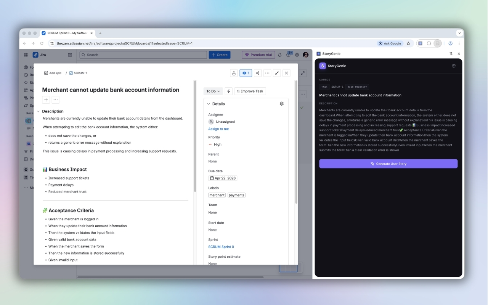
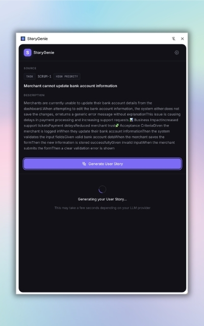
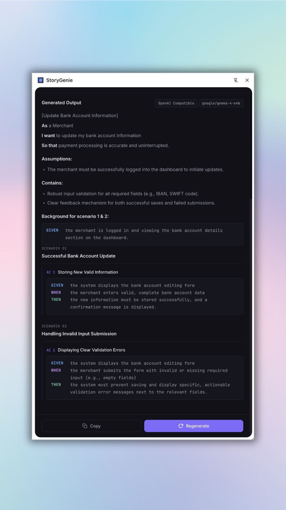

# StoryGenie

**Transform Jira tickets into well-written User Stories using AI.**

StoryGenie is a Chrome Extension that reads data from Jira issue pages and generates structured User Stories using a configurable LLM provider (OpenAI, LM Studio, or any OpenAI-compatible endpoint).

---

## Features

- 🔍 **Auto-detect** Jira issue pages and extract ticket data from the DOM
- 🤖 **Generate User Stories** using any OpenAI-compatible LLM
- 🏠 **Local LLM support** via LM Studio
- 📋 **Copy to clipboard** with one click
- ⚙️ **Configurable** provider, model, temperature, and API key
- 🌙 **Dark mode** support (follows system preference)
- 🔒 **Privacy-first** — no data leaves your machine unless you configure a cloud provider

---

## Screenshots

<p align="center">
  
  
  
</p>

---

## Quick Start

### Prerequisites

- **Node.js** 18+ and npm
- **Chrome** 114+ (for Side Panel API support)

### 1. Install dependencies

```bash
cd storygenie
npm install
```

### 2. Build the extension

```bash
npm run build
```

This runs TypeScript type-checking followed by a Vite build. Output goes to `dist/`.

### 3. Load in Chrome

1. Open `chrome://extensions/`
2. Enable **Developer mode** (toggle in the top right)
3. Click **Load unpacked**
4. Select the `dist/` folder inside this project

### 4. Configure the LLM provider

1. Navigate to any Jira Cloud issue page (e.g., `https://yourorg.atlassian.net/browse/PROJ-123`)
2. Click the StoryGenie icon in the Chrome toolbar — the side panel opens
3. Click the ⚙️ gear icon to open Settings
4. Enter your provider details (see examples below)
5. Click **Save Settings**

### 5. Generate a User Story

1. With the side panel open on a Jira issue page, you'll see the extracted issue data
2. Click **Generate User Story**
3. The generated story appears in the panel
4. Click **Copy to Clipboard** to copy the result

---

## Provider Configuration

### OpenAI

| Field | Value |
|-------|-------|
| Provider | OpenAI Compatible |
| Base URL | `https://api.openai.com/v1` |
| Model | `gpt-4o-mini` (or `gpt-4o`, `gpt-4-turbo`, etc.) |
| API Key | `sk-...` (your OpenAI API key) |
| Temperature | `0.7` |

### LM Studio (Local)

1. Download and install [LM Studio](https://lmstudio.ai/)
2. Load a model (e.g., Llama 3, Mistral, Phi-3)
3. Start the local server in LM Studio (it runs on port 1234 by default)
4. Configure StoryGenie:

| Field | Value |
|-------|-------|
| Provider | OpenAI Compatible |
| Base URL | `http://127.0.0.1:1234/v1` |
| Model | Name of your loaded model (e.g., `lmstudio-community/Meta-Llama-3-8B-Instruct-GGUF`) |
| API Key | Leave empty or enter `lm-studio` |
| Temperature | `0.7` |

### Other Compatible Providers

Any service that implements the OpenAI Chat Completions API will work:

- **Groq**: `https://api.groq.com/openai/v1`
- **Together AI**: `https://api.together.xyz/v1`
- **Ollama** (with OpenAI compatibility): `http://localhost:11434/v1`

---

## Development

### Watch mode

```bash
npm run dev
```

This runs `vite build --watch` and rebuilds on file changes. After each rebuild, go to `chrome://extensions/` and click the refresh icon on the StoryGenie card.

### Type checking

```bash
npm run typecheck
```

---

## Project Structure

```
storygenie/
├── public/
│   ├── manifest.json           # Chrome Extension manifest (V3)
│   └── icons/                  # Extension icons (16, 48, 128px)
├── src/
│   ├── background/
│   │   └── index.ts            # Service worker — message routing
│   ├── content/
│   │   └── jira-extractor.ts   # Content script — DOM extraction (isolated)
│   ├── sidepanel/
│   │   ├── sidepanel.html      # Side panel markup
│   │   ├── sidepanel.ts        # Side panel logic
│   │   └── sidepanel.css       # Side panel styles
│   ├── providers/
│   │   ├── types.ts            # LLMProvider interface
│   │   ├── factory.ts          # Provider factory
│   │   ├── openai-compatible.ts # OpenAI/LM Studio provider
│   │   └── prompt-template.ts  # User Story prompt
│   ├── models/
│   │   ├── jira.ts             # RawJiraIssue, NormalizedIssueInput
│   │   └── story.ts            # UserStoryResult
│   ├── normalizer/
│   │   └── index.ts            # Raw → Normalized conversion
│   ├── storage/
│   │   └── index.ts            # Chrome storage wrapper
│   └── shared/
│       ├── messages.ts         # Message type definitions
│       └── constants.ts        # Default config, storage keys
├── dist/                       # Build output (load this in Chrome)
├── vite.config.ts
├── tsconfig.json
└── package.json
```

---

## Architecture

### Layer Separation

| Layer | Responsibility | Key Files |
|-------|---------------|-----------|
| **Content Script** | DOM extraction, Jira detection | `content/jira-extractor.ts` |
| **Normalization** | Raw data → clean model | `normalizer/index.ts` |
| **Provider** | LLM API abstraction | `providers/*.ts` |
| **Storage** | User preferences | `storage/index.ts` |
| **Background** | Message routing, coordination | `background/index.ts` |
| **UI** | Side panel interface | `sidepanel/*` |

### Data Flow

```
Jira Page → Content Script → Background (normalize) → Side Panel (display)
                                    ↓
                    User clicks "Generate" → Provider → LLM API
                                    ↓
                           Side Panel (display story)
```

### Design Principles

- **Jira DOM logic is isolated** in `content/jira-extractor.ts` — the rest of the codebase never touches DOM selectors
- **Provider logic is behind an interface** — add new providers by implementing `LLMProvider` and registering in the factory
- **Normalization is a pure function** — no side effects, no dependencies on DOM or providers

---

## Adding a New Provider

1. Add a new `ProviderType` discriminator in `src/providers/types.ts`:

```typescript
export type ProviderType = 'openai-compatible' | 'anthropic';
```

2. Create `src/providers/anthropic.ts` implementing `LLMProvider`:

```typescript
export class AnthropicProvider implements LLMProvider {
  readonly name = 'Anthropic';
  async generate(input: NormalizedIssueInput): Promise<UserStoryResult> {
    // Anthropic Messages API implementation
  }
}
```

3. Register in `src/providers/factory.ts`:

```typescript
case 'anthropic':
  return new AnthropicProvider(config);
```

4. Add a `<option>` in `sidepanel.html` settings form.

---

## Future Improvements

### Jira REST API Integration

The current MVP extracts data from the DOM, which can break when Atlassian updates their UI. To migrate to the REST API:

1. **Create** `src/content/jira-api-extractor.ts` (or a separate module)
2. **Extract** the issue key from the URL (already done in the content script)
3. **Call** `GET /rest/api/3/issue/{issueKey}` with proper authentication
4. **Convert** the API response to `RawJiraIssue`
5. The `normalizer`, `providers`, and `UI` layers remain **completely unchanged**

Authentication options:
- API Token (Basic Auth) — simplest for personal use
- OAuth 2.0 (3LO) — required for Atlassian Marketplace distribution

### Other Ideas

- **Streaming responses** — show LLM output as it generates
- **Jira write-back** — post the generated story as a comment
- **Custom prompt templates** — let users define their own format
- **Multi-language** — generate stories in different languages
- **History** — keep a log of previously generated stories
- **Batch mode** — generate stories from JQL search results

---

## License

Private — not yet published.
